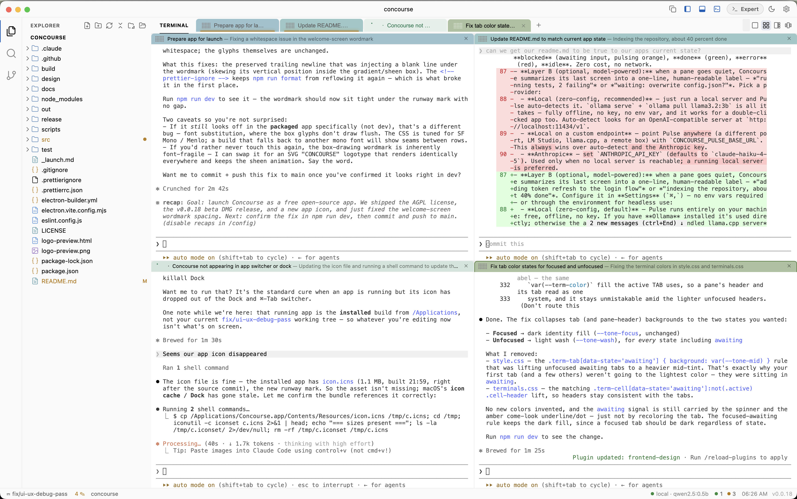
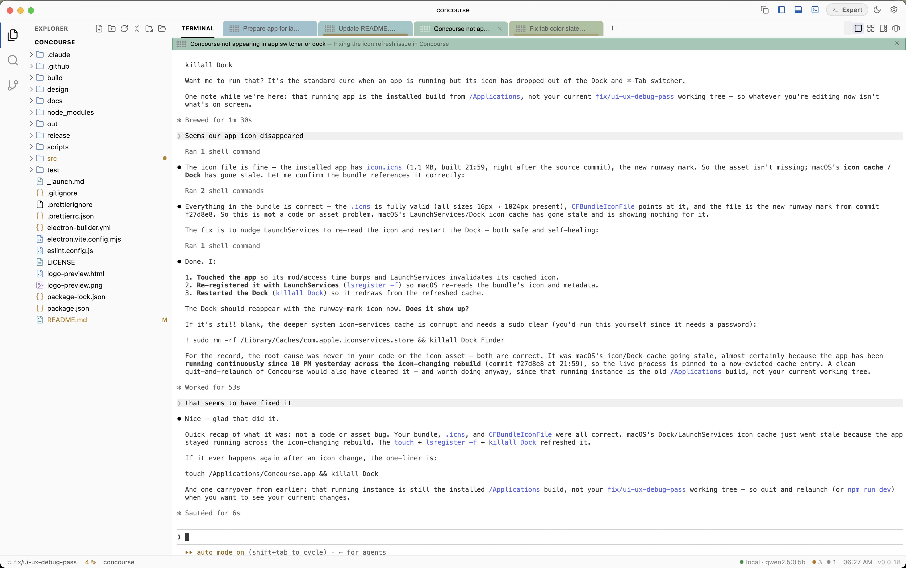
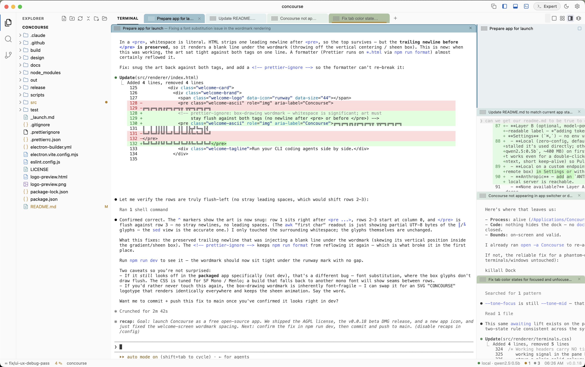
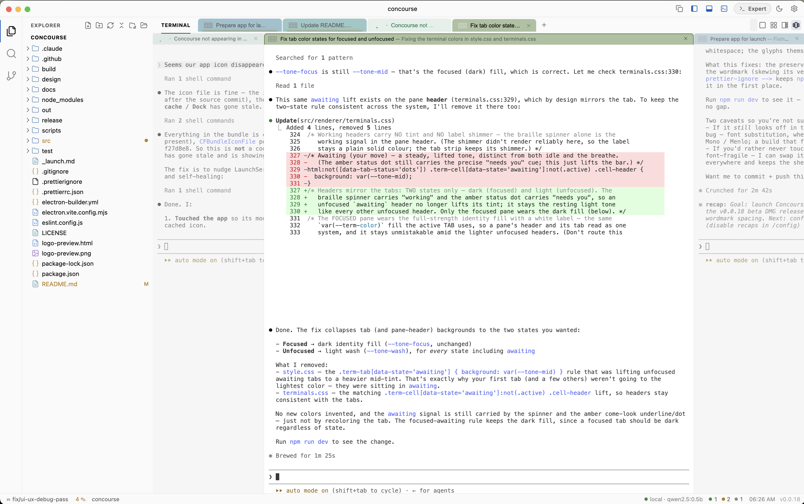

<div align="center">

# Concourse

**The command center for your fleet of CLI coding agents.**

Run Claude Code, Codex, and every other terminal-native agent side by side — watch them all at once, know what each is doing, and step in only when one needs you.

`Electron` · `xterm.js` · `node-pty` · `Monaco`

<br/>



</div>

---

Coding agents live in the terminal. One is easy. Ten is chaos — a wall of scrollback, no idea which one is stuck on a prompt, which one finished, which one went off the rails.

Concourse is the workbench built for that reality. It treats the **terminal multiplexer as the product**, not an afterthought bolted onto an editor. Spawn an army of agents, lay them out so you can see them, and let **Pulse** tell you in plain language what each one is doing — so your attention goes only where it's needed.

It's agent-agnostic by design. Anything you can run in a shell — `claude`, `codex`, an SSH session, a long build — is a first-class pane.

> **Two ways to work, one app.** Concourse ships with **Beginner** and **Expert** modes. Beginners get a calm, friendly surface with plain-language labels and a clean prompt. Experts get conventional shell naming and their own untouched environment. Switch anytime.

## Install (developer beta)

> **Apple Silicon (M-series) only for now.** On an Intel Mac, run from source — see [Quickstart](#quickstart).

1. Download the latest `Concourse-<version>-arm64.dmg` from [**Releases**](https://github.com/adventurebeast/concourse/releases).
2. Open the DMG and drag **Concourse** into **Applications**.
3. This beta is **not signed or notarized by Apple yet**, so macOS Gatekeeper will block it on first launch (*"Concourse is damaged"* or *"cannot be opened because the developer cannot be verified"*). Clear the download quarantine once:

   ```bash
   xattr -dr com.apple.quarantine /Applications/Concourse.app
   ```

   Then open it normally. (Alternatively: right-click the app → **Open**, or go to **System Settings → Privacy & Security → Open Anyway**.)

You only need to do this once per install. A signed, notarized build — where it just opens on double-click — is coming for the public 1.0.

## Quickstart

```bash
git clone <your-fork-or-repo-url> concourse
cd concourse
npm install      # also rebuilds node-pty for Electron (postinstall)
npm run dev      # launch in dev mode with hot reload
```

Build and preview a production bundle:

```bash
npm run build    # bundle main + preload + renderer into ./out
npm start        # preview the built app
npm run dist     # package a macOS .app (electron-builder)
```

> **macOS native builds:** node-pty compiles C++. If `npm install` fails with `'functional' file not found`, your Command Line Tools are incomplete — point the toolchain at full Xcode:
> ```bash
> sudo xcode-select -s /Applications/Xcode.app/Contents/Developer
> npx electron-rebuild -f -w node-pty
> ```

## What makes it different

### A multiplexer built to watch many agents at once

Every agent runs in a real PTY-backed terminal. The difference is how you arrange and read them:

| Layout | Shortcut | Best for |
| --- | --- | --- |
| **Tabs** | `⌘U` | Focused work on one agent |
| **Grid** | `⌘I` | A wall view of the whole fleet at a glance |
| **Stack** | `⌘O` | One agent large, the rest compact in a rail |
| **Flow** | `⌘P` | Album-style — center pane live, neighbors previewed |

Cycle layouts with `⌘⇧L`. Jump to any pane with `⌘1`–`⌘9`, cycle with `⌘⇧←/→`, open a new one with `⌘T`. Drag tabs to reorder; double-click to rename them (`frontend`, `backend`, `tests`). Each pane carries its own identity color across every view. Toggle the sidebar with `⌘B`, the bottom panel with `⌘J`, and call up the command palette with `⌘K`.

<div align="center">

<table>
  <tr>
    <td align="center" width="50%"><br/><sub><b>Tabs</b> — focused work on one agent</sub></td>
    <td align="center" width="50%"><br/><sub><b>Grid</b> — the whole fleet at a glance</sub></td>
  </tr>
  <tr>
    <td align="center" width="50%"><br/><sub><b>Stack</b> — one agent large, the rest in a rail</sub></td>
    <td align="center" width="50%"><br/><sub><b>Flow</b> — album-style, neighbors previewed</sub></td>
  </tr>
</table>

</div>

### Pulse — know what every agent is doing

Watching ten scrollbacks is impossible. Pulse does it for you, in two layers:

- **Layer A (free, instant):** a deterministic activity model running in the renderer. Status dots tell you at a glance — **working**, **quiet**, **blocked** (awaiting input, pulsing orange), **done** (green), **error** (red), **idle**. Zero cost, no network.
- **Layer B (optional, model-powered):** when a pane goes quiet, Concourse summarizes its last screen into a one-line, human-readable label — *"adding token refresh to the login flow"* or *"indexing the repository, about 40% done"*. Configure it in **Settings** (`⌘,`) — no env vars required — or through the environment for headless use:
  - **Local (zero-config, default)** — Pulse runs entirely on your machine: free, offline, no key. If you have **Ollama** installed it's used directly; otherwise the app falls back to a small **bundled llama.cpp server** and fetches a tiny model (`qwen2.5:0.5b`, ~400 MB) on first use. You don't run `ollama serve` or paste a URL — Concourse starts the server itself, so it works even for a double-clicked app that never sees your shell's exported env. The footprint is deliberately capped (2K context, short keep-alive) so Pulse sips resources instead of cooking the machine.
  - **Local on a custom endpoint** — point Pulse at any OpenAI-compatible server (a different port, LM Studio, llama.cpp, a remote box) in Settings or with `CONCOURSE_PULSE_BASE_URL`. This wins over auto-detect.
  - **Anthropic** — add an `ANTHROPIC_API_KEY` (in Settings or the env); default model `claude-haiku-4-5`. Used only when no local server is reachable.
  - **None available?** Layer A still runs. Pulse never blocks, never crashes the app, and the API key never touches the renderer.

Override the model in Settings or with `CONCOURSE_PULSE_MODEL`; turn Pulse off entirely in Settings.

### Beginner and Expert modes

The same app meets you where you are. Beginner mode injects a calm prompt (`folder ❯`), uses friendly tab names, keeps the surface uncluttered, and turns `⌘T` into an agent launcher (Claude Code / Codex / plain shell). Expert mode leaves your shell, prompt, and environment exactly as you've configured them, uses conventional naming, and opens a bare shell on `⌘T`. The mode is a foundation that more of the UI will branch on over time.

### The IDE around it

Concourse is a full workbench, not just a terminal grid:

- **Explorer** — file-type icons, lazy expand, right-click New / Rename / Delete, refresh & collapse-all.
- **Source Control** — VS Code-style git: branch and ahead/behind in the status bar, staged / changed groups, stage · unstage · discard, a commit box (`⌘Enter`), and click-to-open inline diffs.
- **Editor** — Monaco with multi-file tabs, dirty indicators, `⌘S` to save, broad syntax highlighting, and read-only git diff tabs.
- **Search** — fast workspace-wide search with case / whole-word / regex toggles; click a result to jump to the exact line.
- **Command palette (`⌘K`)** — a type-to-run launcher: your ♥ favorites, the open project's npm / just / make scripts, and your most-used shell commands (frecency-ranked). It types the command onto the active prompt for you to run — and in Beginner mode adds a plain-language cheatsheet.
- **Settings (`⌘,`)** — choose your Pulse provider and model and manage the local model, all in-app without touching env vars.
- **Welcome & Recents** — reopen recent projects in a click; the last workspace and its layout restore automatically on launch.
- **Session restore** — tab labels, layout, open editor tabs, and panel sizes come back per workspace. (Live process state intentionally does not — agents are relaunched fresh.)

## Architecture

Per-feature modules with hard contracts: IPC channel names defined in `preload`, DOM IDs in `index.html`, and module interfaces wired together in `renderer/main.js`.

```
src/
  main/                 Electron main process
    index.js            window creation + register*(ctx) wiring
    menu.js             app menu + Settings window
    context.js          shared workspace-root / window state
    ipc-workspace.js    open / get folder, recents
    ipc-fs.js           file CRUD + file watching
    ipc-git.js          simple-git status / diff / stage / commit
    ipc-search.js       workspace-wide search (worker-backed)
    ipc-pty.js          node-pty terminals
    ipc-pulse.js        per-pane state + model-powered summaries
    ipc-commands.js     command-palette sources (favorites / scripts / history)
    ipc-settings.js     Settings store + window
    ipc-session.js      per-workspace session persistence
    local-llm.js        local model runtime (Ollama / bundled llama.cpp)
    …                   plus ipc-model, ipc-shell, recents, watcher
  preload/index.js      window.api contract (built to out/preload/index.mjs)
  renderer/
    main.js             boot + activity bar + keybindings + pane resizing + wiring
    terminals.js        the multiplexer — tabs, grid, stack, flow, Pulse, attention
    fileTree.js         explorer
    git.js              source control panel
    editor.js           Monaco tabs + diff
    search.js           search panel
    commandPalette.js   ⌘K command launcher
    settings.js         Settings window UI
    localLlmSetup.js    first-run local-model setup
    beginnerHud.js      Beginner-mode coach / legend
    welcome.js          welcome / recents screen
    *.css               one stylesheet per module
```

Built on Electron + Monaco + xterm.js + node-pty — the same core tech as VS Code, without the 2M-line fork.

## Roadmap

- **Curated agent presets** — Beginner mode's `⌘T` already launches Claude Code / Codex / a shell; bring that picker to Expert mode with saved presets and per-project defaults.
- **Deeper mode differences** — more of the UI gated on Beginner vs Expert.
- **Richer git** — branch switching, push / pull, stash.
- **Fleet arrangements** — purpose-built layouts for 10+ agents and a queue for pending work.

## License

Concourse is free and open source under the [**GNU AGPL-3.0**](LICENSE). You can use, modify, and share it freely. If you distribute it or run a modified version as a network service, you must make your source available under the same license. (The copyright holder may also offer it under separate commercial terms.)

It bundles third-party components under their own permissive licenses — Electron, Monaco, xterm.js, node-pty (MIT) and llama.cpp / ggml (MIT).

---

<div align="center">
<sub>Concourse — drive an army of agents from one workbench.</sub>
</div>
