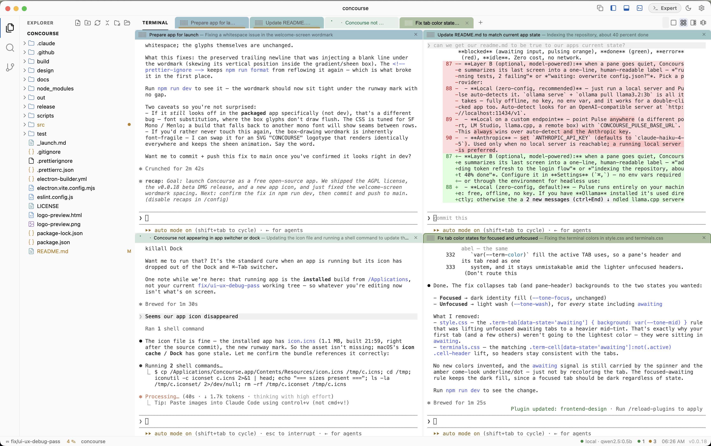
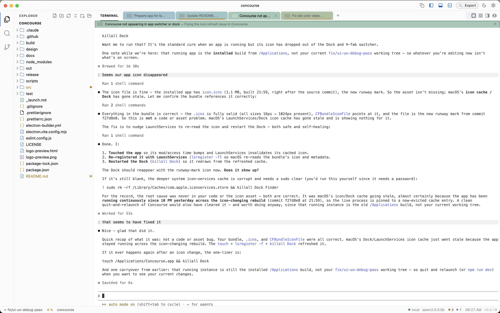
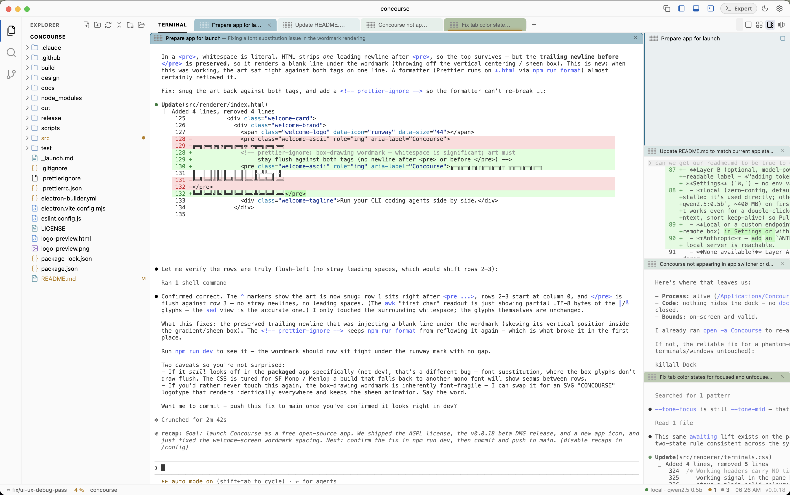
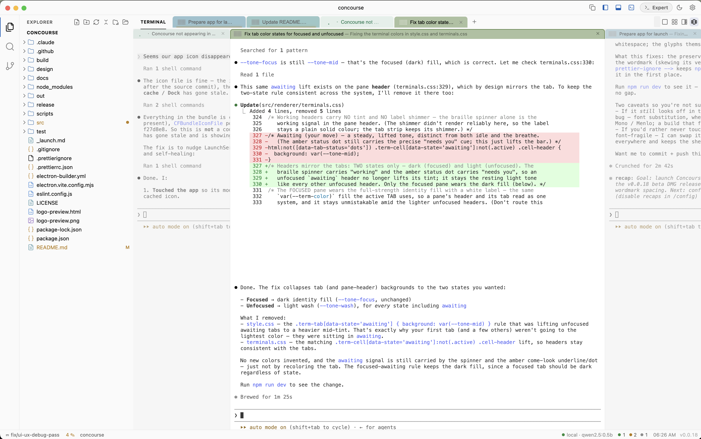

<div align="center">


# Concourse

**The command center for your fleet of CLI coding agents.**

Run Claude Code, Codex, and every other terminal-native agent side by side — watch them all at once, know what each is doing, and step in only when one needs you.

`Electron` · `xterm.js` · `node-pty` · `Monaco`

<br/>



</div>

---

Concourse is the simplest way to run a whole fleet of AI coding agents at once. Keep your terminals organized, switch between them in a keystroke, and keep track of what they're all doing — without drowning in scrollback.

Run as many agents as you like, lay them out so you can see them all, and let **Pulse** show which panes are working, idle, or awaiting you.

It's a full IDE — explorer, editor, git, search — but **terminal-first, not editor-first**. The AI agents do the coding now, so the terminals where they work are the main view; the code editor is there for when you want to read or tweak what they wrote, not the center of gravity.

It's agent-agnostic by design. Anything you can run in a shell — `claude`, `codex`, an SSH session, a long build — is a first-class pane.

And it's built to be **ultrafast, lightweight, and easy on your system**: a vanilla-JS renderer with no UI framework and only a handful of runtime dependencies, so the workbench stays snappy and leaves your machine's resources for the agents you're actually running.

> **Terminal privacy boundary.** Concourse forwards keystrokes directly to the PTY but never inspects, retains, or derives metadata from those bytes. Terminal input, output, shell history, OSC titles, restored labels, commands, and generated summaries cannot name a tab. Headers are immutable ordinal identities such as `Terminal 1`.

## Install (developer beta)

> **Apple Silicon (M-series) only for now.** On an Intel Mac, run from source — see [Quickstart](#quickstart).

1. Download the latest `Concourse-<version>-arm64.dmg` from [**Releases**](https://github.com/adventurebeast/concourse/releases).
2. Open the DMG and drag **Concourse** into **Applications**.
3. Open Concourse normally. Public macOS artifacts are Developer ID-signed, Apple-notarized, stapled, and Gatekeeper-verified by CI before they can appear on the release page.

If a release does not include a macOS DMG, its signing/notarization checks have not completed successfully; do not use or redistribute an unsigned local build as a substitute.

## Quickstart

```bash
git clone <your-fork-or-repo-url> concourse
cd concourse
npm install      # also rebuilds node-pty for Electron (postinstall)
npm run dev      # launch in dev mode with hot reload
```

Build and preview a production bundle:

```bash
npm run build    # bundle main + preload + renderer into ./out
npm start        # preview the built app
npm run dist     # package a macOS .app (electron-builder)
```

Install the current source as your local production app:

```bash
npm run install:local  # rebuild, verify, and replace /Applications/Concourse.app
npm run release        # do the same local install, then publish only when signing credentials exist
```

The local installer stages and verifies the complete app before replacing the existing bundle. It moves the previous app to Trash, clears quarantine from the new local build, and launches it unless Concourse is already running. A running instance is never terminated because it may contain active terminals; quit and reopen it to load the new build. Local ad-hoc signing is for this Mac only—public downloads are produced separately by the signed and notarized CI workflow.

> **macOS native builds:** node-pty compiles C++. If `npm install` fails with `'functional' file not found`, your Command Line Tools are incomplete — point the toolchain at full Xcode:
> ```bash
> sudo xcode-select -s /Applications/Xcode.app/Contents/Developer
> npx electron-rebuild -f -w node-pty
> ```

## What makes it different

### A multiplexer built to watch many agents at once

Every agent runs in a real PTY-backed terminal. The difference is how you arrange and read them:

| Layout | Shortcut | Best for |
| --- | --- | --- |
| **Tabs** | `⌘U` | Focused work on one agent |
| **Grid** | `⌘I` | A wall view of the whole fleet at a glance |
| **Stack** | `⌘O` | One agent large, the rest compact in a rail |
| **Flow** | `⌘P` | Album-style — center pane live, neighbors previewed |

Cycle layouts with `⌘⇧L`. Jump to any pane with `⌘1`–`⌘9`, cycle with `⌘⇧←/→`, open a new one with `⌘T`, and drag tabs to reorder. Each pane has an immutable ordinal name and carries its own identity color across every view. Toggle the sidebar with `⌘B`, the bottom panel with `⌘J`, and call up the command palette with `⌘K`.

<div align="center">

<table>
  <tr>
    <td align="center" width="50%"><br/><sub><b>Tabs</b> — focused work on one agent</sub></td>
    <td align="center" width="50%"><br/><sub><b>Grid</b> — the whole fleet at a glance</sub></td>
  </tr>
  <tr>
    <td align="center" width="50%"><br/><sub><b>Stack</b> — one agent large, the rest in a rail</sub></td>
    <td align="center" width="50%"><br/><sub><b>Flow</b> — album-style, neighbors previewed</sub></td>
  </tr>
</table>

</div>

### Pulse — know which agent needs you

Watching ten scrollbacks is impossible. Pulse uses only local, deterministic signals:

- **Working:** visible terminal activity continues after the user's prompt echo.
- **Awaiting you:** a settled screen ends in a high-confidence input prompt, or an alternate-screen TUI has gone quiet.
- **Idle:** the pane has settled without an explicit request for input.

This preserves the useful attention signal without turning terminal content into labels or sending it to a model. Tabs use stable names (`Tab 1`, `Claude`, `Codex`, etc.); double-click a tab when you want an explicit custom name.

An optional model can curate the command palette from commands declared in `package.json`, Justfiles, and Makefiles. Those candidates are allowlisted before and after the model call; terminal text and command history are never inputs.

### The IDE around it

Concourse is a full workbench, not just a terminal grid:

- **Explorer** — file-type icons, lazy expand, right-click New / Rename / Delete, refresh & collapse-all.
- **Source Control** — VS Code-style git: branch and ahead/behind in the status bar, staged / changed groups, stage · unstage · discard, a commit box (`⌘Enter`), and click-to-open inline diffs.
- **Editor** — Monaco with multi-file tabs, dirty indicators, `⌘S` to save, broad syntax highlighting, and read-only git diff tabs.
- **Search** — fast workspace-wide search with case / whole-word / regex toggles; click a result to jump to the exact line.
- **Command palette (`⌘K`)** — a type-to-run launcher for explicit favorites and the open project's npm / just / make commands. It types the command onto the active prompt for you to run.
- **Settings (`⌘,`)** — configure terminals, layouts, appearance, and optional AI command curation.
- **Welcome & Recents** — reopen recent projects in a click; the last workspace and its layout restore automatically on launch.
- **Session restore** — explicit tab labels, layout, cwd, open editor tabs, and panel sizes come back per workspace. (Live process state intentionally does not — agents are relaunched fresh.)

## Commands & shortcuts

Everything is a keystroke away — drive the whole fleet without reaching for the mouse. (`⌘` is `Ctrl` on Linux/Windows.)

**Layouts & panes**

| Shortcut | Action |
| --- | --- |
| `⌘U` · `⌘I` · `⌘O` · `⌘P` | Switch layout — Tabs · Grid · Stack · Flow |
| `⌘⇧L` | Cycle through the layouts |
| `⌘1`–`⌘9` | Jump straight to pane 1–9 |
| `⌘⇧←` / `⌘⇧→` | Previous / next pane (also `⌘[` / `⌘]`) |
| `⌘;` / `⌘'` | Move the active pane left / right in the rail |
| `⌘T` | New terminal |
| `⌘W` | Close the active pane |

**Workbench**

| Shortcut | Action |
| --- | --- |
| `⌘K` | Command palette — favorites and project scripts |
| `⌘B` | Toggle the sidebar |
| `⌘J` | Toggle the bottom panel |
| `⌘⇧F` | Jump to Search |
| `⌘,` | Settings |
| `⌘⇧O` | Open folder |
| `⌘N` / `⌘⇧N` | New file / new window |
| `⌘S` | Save (editor) |
| `⌘Enter` | Commit (Source Control) |
| `⌘F` | Find (editor) |

The **command palette** (`⌘K`) surfaces your explicit favorites and commands declared by the open project's npm / just / make configuration. Pick one and it types the command onto the active prompt — you press Enter — so the terminal remains a plain display. Novel commands appear only while you type them and are retained only if you explicitly save them as a favorite.

## Architecture

Per-feature modules with hard contracts: IPC channel names defined in `preload`, DOM IDs in `index.html`, and module interfaces wired together in `renderer/main.js`.

```
src/
  main/                 Electron main process
    index.js            window creation + register*(ctx) wiring
    menu.js             app menu + Settings window
    context.js          shared workspace-root / window state
    ipc-workspace.js    open / get folder, recents
    ipc-fs.js           file CRUD + file watching
    ipc-git.js          simple-git status / diff / stage / commit
    ipc-search.js       workspace-wide search (worker-backed)
    ipc-pty.js          node-pty terminals
    ipc-pulse.js        optional provider for grounded command suggestions
    ipc-commands.js     command-palette sources (favorites / declared scripts)
    ipc-settings.js     Settings store + window
    ipc-session.js      per-workspace session persistence
    local-llm.js        local model runtime (Ollama / bundled llama.cpp)
    …                   plus ipc-model, ipc-shell, recents, watcher
  preload/index.js      window.api contract (built to out/preload/index.mjs)
  renderer/
    main.js             boot + activity bar + keybindings + pane resizing + wiring
    terminals.js        the multiplexer — tabs, grid, stack, flow, Pulse, attention
    fileTree.js         explorer
    git.js              source control panel
    editor.js           Monaco tabs + diff
    search.js           search panel
    commandPalette.js   ⌘K command launcher
    settings.js         Settings window UI
    localLlmSetup.js    first-run local-model setup
    welcome.js          welcome / recents screen
    *.css               one stylesheet per module
```

Built on Electron + Monaco + xterm.js + node-pty — the same core tech as VS Code, without the 2M-line fork. The renderer is plain JavaScript and CSS, one small module per feature, with no React/Vue/build-time UI framework and only a handful of runtime dependencies — kept deliberately lean so it loads fast and stays out of the agents' way.

## Roadmap

- **Curated agent presets** — saved presets and per-project defaults without exposing terminal input.
- **Richer git** — branch switching, push / pull, stash.
- **Fleet arrangements** — purpose-built layouts for 10+ agents and a queue for pending work.

## License

Concourse is free and open source under the [**GNU AGPL-3.0**](LICENSE). You can use, modify, and share it freely. If you distribute it or run a modified version as a network service, you must make your source available under the same license. (The copyright holder may also offer it under separate commercial terms.)

It bundles third-party components under their own permissive licenses — Electron, Monaco, xterm.js, node-pty (MIT) and llama.cpp / ggml (MIT).

---

<div align="center">
<sub>Concourse — drive an army of agents from one workbench.</sub>
</div>
